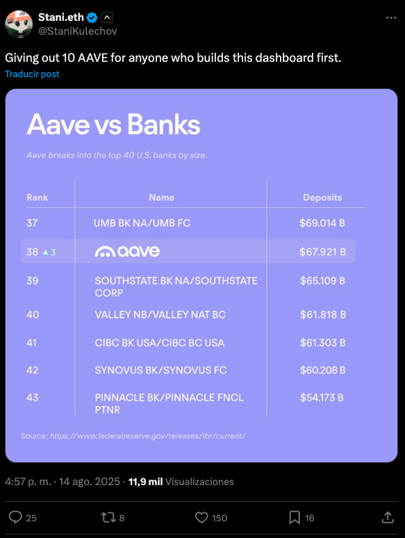

# 🏦 Aave vs US Banks — Real-time Comparison Dashboard

A real-time dashboard that compares **Aave's net deposits** with the consolidated assets of the **top 50 U.S. commercial banks**, showing exactly where Aave would rank if it were a traditional bank.

  

This project was inspired by a challenge proposed by **Stani Kulechov** (founder of [Aave](https://aave.com)):

> "Giving out 10 AAVE for anyone who builds this dashboard first."

---

## 🚀 Features

- **Real-time Data**: Live scraping of current bank assets and Aave deposits
- **Accurate Rankings**: Shows Aave's position among top 50 US banks by consolidated assets
- **Beautiful Design**: Clean, modern interface with Roboto Mono and Inter fonts
- **Live Sources**: Direct links to Federal Reserve and Token Terminal data

---

## 🔍 Data Collection Method

This project uses **web scraping** to gather real-time data from official sources:

### 🏦 U.S. Bank Data
- **Source**: [Federal Reserve LBR (Large Bank Report)](https://www.federalreserve.gov/releases/lbr/current/)
- **Method**: Web scraping of consolidated assets data
- **Coverage**: Top 50 US commercial banks by assets
- **Data**: JPMorgan Chase ($3.6T), Bank of America ($2.5T), Wells Fargo ($1.9T), etc.

### ⛓️ Aave Data  
- **Source**: [Token Terminal - Aave Net Deposits](https://tokenterminal.com/explorer/projects/aave/metrics/net-deposits)
- **Method**: Web scraping with API fallback
- **Data**: Current net deposits (~$68.3B)
- **Fallback**: Token Terminal API endpoint

## 🎯 How It Works

1. **Data Fetching**: 
   - Scrapes Federal Reserve for real bank consolidated assets
   - Scrapes Token Terminal for current Aave net deposits

2. **Ranking Algorithm**:
   - Sorts all banks by consolidated assets (descending)
   - Inserts Aave at its correct position based on net deposits
   - Shows banks ±5 positions around Aave for context

3. **Real-time Display**:
   - Loading state: "Loading data onchain and from Federal Reserve..."
   - Dynamic table showing accurate rankings
   - Aave highlighted with logo and styling

---
